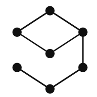

# graphlow: Graph for Physics
graphlow provides graph processing features for physical simulation data (e.g., mesh).
graphlow can:
- Read vtk data that are widely used in physical simulation
- compute mesh features in a differentiable manner
- compute spatial differential operators required for physics simulations involving meshes

# Documentation
https://ricosjp.github.io/graphlow/

# License

[Apache License 2.0](./LICENSE).

