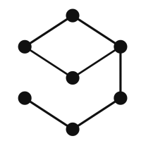

# graphlow: Graph for Physics
graphlow is a differentiable mesh-graph library.

It bridges geometry, mesh topology, and sparse graph operators,
allowing geometric metrics and connectivity-based operators
to be used seamlessly with automatic differentiation.

# Documentation
https://ricosjp.github.io/graphlow/

**Migrating from 0.0.x:** breaking changes for 0.1.0 are summarized in
[docs/source/release_notes.rst](docs/source/release_notes.rst) (section **0.1.0**).

# License

[Apache License 2.0](./LICENSE).
